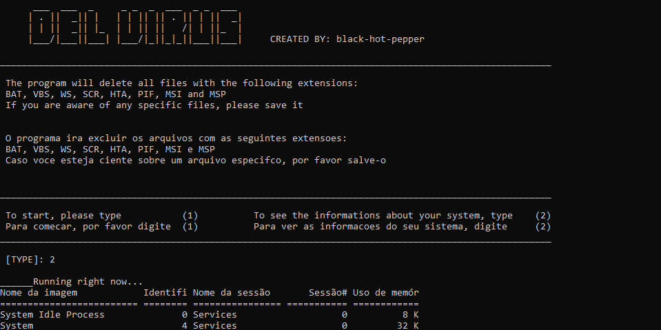

# DelVirus 
<div>
  <p> <h2> 💉A simple and easy virus removal program💉 </h2> </p>
</div>
<div>
  <p> Made with C++ language, DelVirus can delete all malicious files with specific extensions from your system!</p>
  <p> Exclusive to Windows OS!</p>
  <p> (Feito com C++, DelVirus promete deletar todos os arquivos maliciosos com extensões especificas do seu sistema!)</p>
  <p> (Exclusivo para o sistema operacional Windows)</p>
</div>
<div>
    
</div>
<div>
  <h1> <p> How to Install</p> </h1>
  <p> You can download it as ZIP file and extract it with WinRar, or you can use only Git Bash</p>
  <p> Go to GitHub Windows install page and download it: https://gitforwindows.org/</p>
  <p> (Você pode baixa-lo como um arquivo zipado, e então extraí-lo com o WinRar, ou você pode usar o Git Bash, baixando-o para Windows )</p>
</div>

<div>
  <p> <br> After you did that, you can go to the next stap, download it! For that, type the command below in your Git Bash.</p>
  <p>(Após ter feito os passos acima, você pode ir para o próximo passo, baixá-lo! Para isso, digite o comando abaixo no seu terminal do Git)</p>
  
  ```
  git clone https://github.com/BlackHotPepper/DelVirus
  ```
  
</div>
